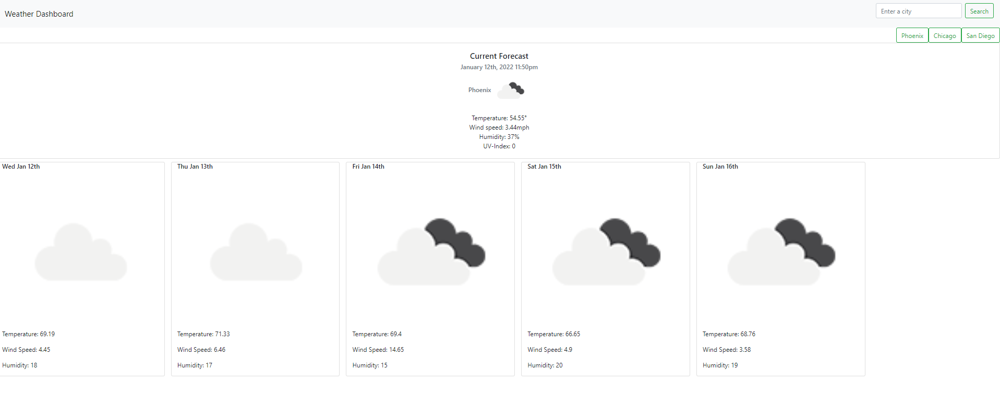

# Weather-Dashboard

## Description

A weather dashboard application that allows users to search for a city and view the current weather and the upcoming 5-day forecast. Prior searches are added to a tab bar for future references.

## [Try it yourself!](https://maestroluu.github.io/Weather-Dashboard/)

The following images show a glimpse of the application:

## Getting Started

This is a simple application that runs right in the browser, no installation or downloads needed.

## Built With:

HTML  
JavaScript/jQuery  
Bootstrap  
OpenWeatherMap API  
Moment

## Author:

David Luu

## Planned Updates

Issues regarding color changes to indicate UV-Index data and background image display for improved UI will be addressed in upcoming updates.